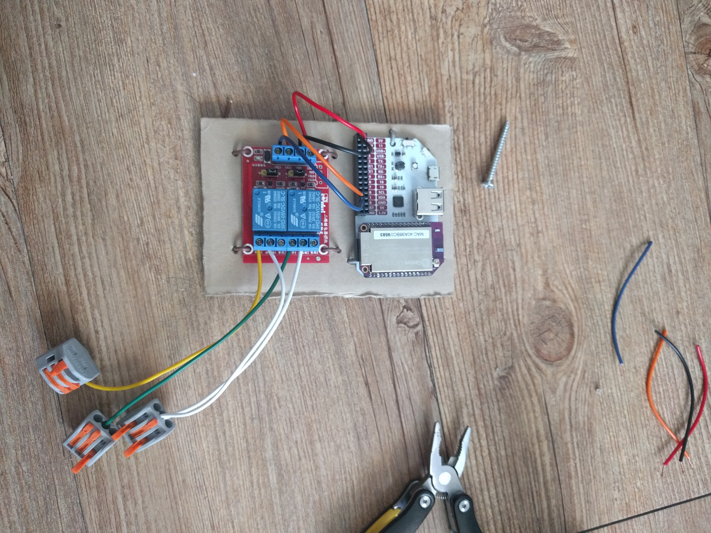

Apagando
========

Simple Smart Switch for lights.

*Apagando* means *Turning off* in Spanish.
I named it this because inpired by *Sombra* in *Overwatch*. Their ultimate
voiceline is "¡Apagando las luces!" which means "Turning off the lights".

Hardware requirements
---------------------

I use `Onion Omega 2 Plus`_ to make this.

- `Onion Omega 2 Plus`_.
- 2 relay switch.
- 3 way light switch (for manually control).

My setup like this.

.. _Onion Omega 2 Plus: https://onion.io/

Software requirements
---------------------

.. code-block:: console

   $ opkg install python-light python-pip pyOnionGpio
   $ pip install -r requirements.txt
   # Run apagando on boot
   $ ln -sf $PWD/start.sh /etc/rc.d/S99apagando

Configuration
-------------

I connect two relay switch to GPIO 0 and 1.
I planned to connect place small switch next to 3 way switch to synchronize 3 way switch's state.
It works like an XOR gate, So you can turn on the light even when Apagando malfunctioning.
And apagando returns **The light**'s status for `status` REST API.

+--------------+--------------+-----------+
| 3 way switch | Relay switch | The light |
+==============+==============+===========+
| on           | on           | off       |
+--------------+--------------+-----------+
| on           | off          | on        |
+--------------+--------------+-----------+
| off          | on           | on        |
+--------------+--------------+-----------+
| off          | off          | off       |
+--------------+--------------+-----------+

Edit ``.env`` to configuration

.. code-block:: sh

   # Relay's GPIO ports.
   RELAY0=17  # Red LED for testing.
   RELAY1=15  # Blue LED for testing.

   # Physical switch's GPIO ports.
   SWITCH0=2
   SWITCH1=3
   # Or don't set SWITH#n for disable 3 way switch.
